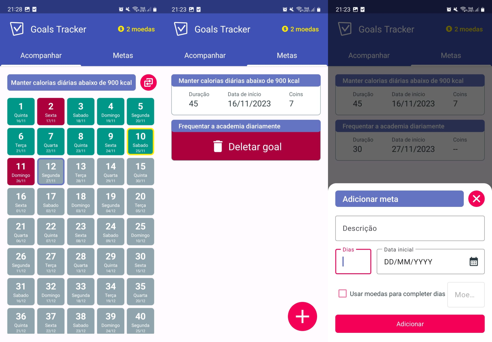
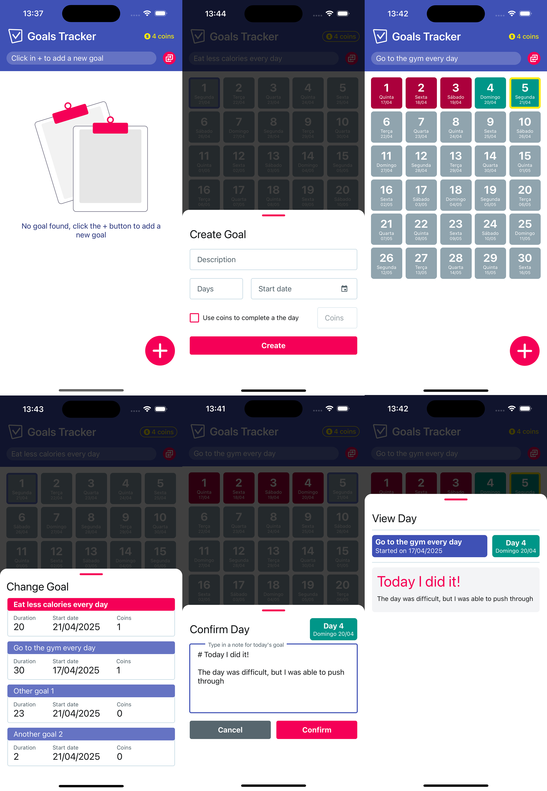

#  Goals Tracker v2

A native mobile app to help users track habits, tasks, notes, and schedules. It's built with React Native and works on both Android and iOS.

## Goals Tracker v1 vs v2

The first version of Goals Tracker was built with Kotlin and `.xml` layouts, focusing on Android only. While functional, it wasn't cross-platform support.

In V2, the app was rebuilt using React Native, enabling support for both Android and iOS. The UI was improved. Features like the ability to edit yesterday's goals and add notes for errors were introduced, making the app more versatile and practical.

v1

    

v2

    

## Features

### Core Features

- **Goal Management**:

  - Create goals with a description, duration, start date, and coin threshold.
  - Delete goals when no longer needed.
  - View goals in a grid format, with each day represented as a card.
  - Mark the current day as completed (green card) or not completed (red card).
  - Complete each day and add a note to it.
  - Use coins to unlock a **Cheat Day** (green and gold card).

- **Error Handling**:
  - Add notes to days marked as errors for better tracking.
  - Change the status of yesterday's goal if it was missed by mistake.

### Additional Rules

- Earn 1 coin for every day marked as completed.
- Use coins to unlock a **Cheat Day**, allowing you to skip a day without affecting your progress.
- Synchronize goal statuses daily to ensure accurate tracking.

### New Features in V2

- **Edit Yesterday's Goal**: If you forgot to mark a goal as completed, you can update it the next day.
- **Enhanced Success UI**: Motivational confetti animation to celebrate achievements :).
- **Dark Theme**: A dark mode for better usability in low-light environments.
- **Notes for Success and Error**: Add notes to success and error days for better context and tracking.

## Programing decisions

### Why React Native?

The switch from Kotlin to React Native was made to support both Android and iOS platforms with a single codebase.

### MVVM Architecture

The app follows an MVVM-like architecture inspired by Domain-Driven Design (DDD). The `Model` represents the domain logic (e.g., `goal.ts`), while the `ViewModel` (e.g., `goalsSlice`) handles state management and acts as a bridge between the UI and the domain.

### Technologies used

- Figma
- React Native with Expo
- AsyncStorage
- NativeWind
- React Hook Form
- Jest fo the Zustand ViewModel
- Vitest for the Model

## TODOs

### First Release

- [x] Notes for errors
- [x] Better success UI for motivating users
- [x] Logos and Assets
- [x] Dark theme
- [x] iOS Test App for personal usage

### Second Release

**Features**

- [ ] Push notifications
- [ ] Login per user (Google and Apple)
- [ ] Better icons for dark theme
- [ ] Edit goal name
- [ ] Add the days of the week for the goal
- [ ] Internationalization

**Bugs**

- [x] Date input first date change is wrong
- [x] Reduce confetti speed
- [ ] Big confetti for completing a goal
- [ ] Filter for completed todos
- [x] After Form.reset() the labels stay at the top of the input
- [x] On Android, input label tap does not work
- [x] KeyboardAvoidingView breaking scroll behaviour

**Infra**

- [ ] Add dependabot
- [ ] Add GitHub Actions checks

### Third Release

- [ ] WhatsApp AI to complete and read data
- [ ] Month Report of what was done
- [ ] After completing a goal, check if user wants to check others
- [ ] Partial (yellow) state
